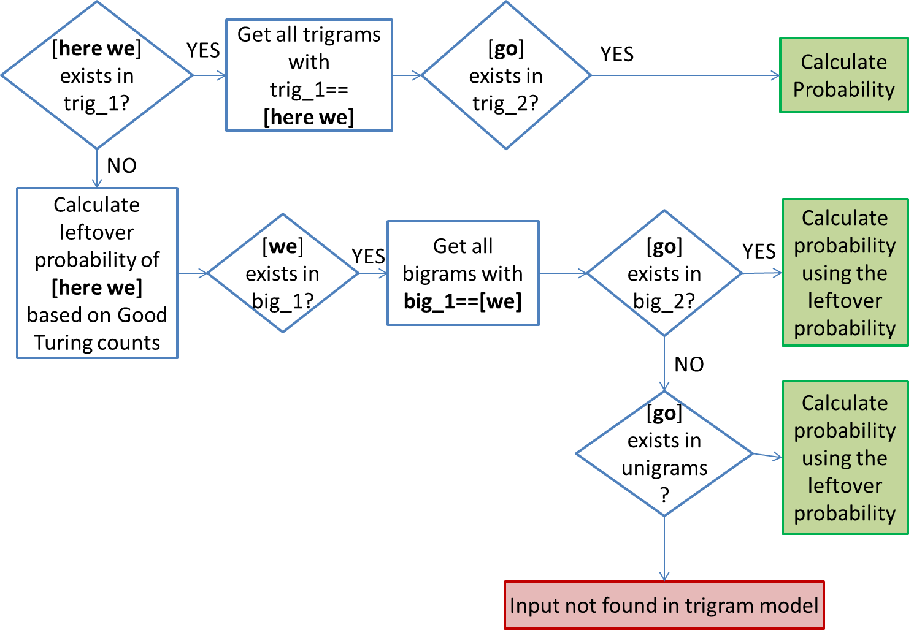

# What's Next

**What's Next** is a Shiny application that uses NLP models for text prediction. The application was part of Coursera's Data Science Capstone Project. It provides two options as shown in the screenshots:

- **Next Word Prediction**

- **Trigram Model Probability**

**What's Next** is deployed on Shinyapp.io: [HERE](https://omaymas.shinyapps.io/What_is_next/)

<figure >

<figcaption style="font-size: 0.5em;">Fig.1-What's Next Tabs</figcaption>
</figure>

## Example: P(here we go)

<figure >

<figcaption style="font-size: 0.5em;">Fig.2-P(here we go) using Katz's Backoff</figcaption>
</figure>

