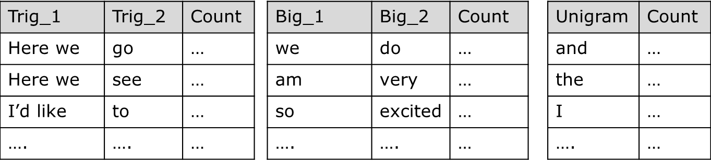

What's Next (Text Prediction Application)
========================================================
author: OmaymaS
date: 30 Dec 2016
autosize: true

About What's Next
========================================================
left: 30%

<small>
**What's Next** is a Shiny application that uses NLP models for text prediction. It provides two options as shown in the screenshots:

- **Next Word Prediction**

- **Trigram Model Probability**

</small>

***
<figure >

<figcaption style="font-size: 0.5em;">Fig.1-What's Next Tabs</figcaption>

</figure>

<small>
-**What's Next** on Shinyapp.io: [HERE](https://omaymas.shinyapps.io/What_is_next/)  
-Created by [OmaymaS](https://github.com/OmaymaS)
</small>

Getting Started With What's Next
========================================================
class: small-code

**Next Word Prediction**

Enter text to get the top-3 predicted words based on your input.<i> (similar to mobile phones and other gadgets' keyboards)</i>.

|Input                          |W1     |W2    |W3    |
|:------------------------------|:------|:-----|:-----|
|here we go                     |to     |on    |again |
|I'd like to see                |you    |the   |what  |
|I'd like to say thanks for the |follow |first |RT    |

***
**Trigram Model Probaibiliy**

Enter three words <i>(Trigram)</i> to get its probability   

 

|Input             |Output                         |
|:-----------------|:------------------------------|
|here we go        |P(Here we go)                  |
|and we can do the |P(can do the)                  |
|the first         |Not found in the trigram model |

<ul style="font-size: 0.5em;" >
<li >If Input>3 word, only the last 3 are considered.</li>
<li> If Input<3 word, or if the trigram is not found in our model, the user gets a message "Not found in the trigram model</li>
</ul>

Technical Details (Katz's backoff Model) 1/2
========================================================

Using 70% of the given dataset:  

<ul >
<li >data was cleaned removing symbols, profanity, extra spaces, non-latin characters and certain words/letters.</li>
<li >unigram, bigram and trigram datatables were generated with the count of each entry.</li>

<figure >

</figure>

<li> Good-Turing discounts were calculated for Nr<=5 <i>(Nr: frequency of frequency).</i> </li>
<li> Probability is calculated using Katz's Backoff model as shown in the example in Fig-2.</li>
</ul>

**Advantage**: *Reactive*

**Tradeoffs**: *Accuracy  Vs. Speed*

**Areas for Improvement**:  *Application Startup Speed*

Technical Details (Katz's backoff Model) 2/2
========================================================

<figure align="center">

<figcaption style="font-size: 0.5em;">Fig.2- P(here we go) using Katz's Backoff</figcaption>

</figure>

